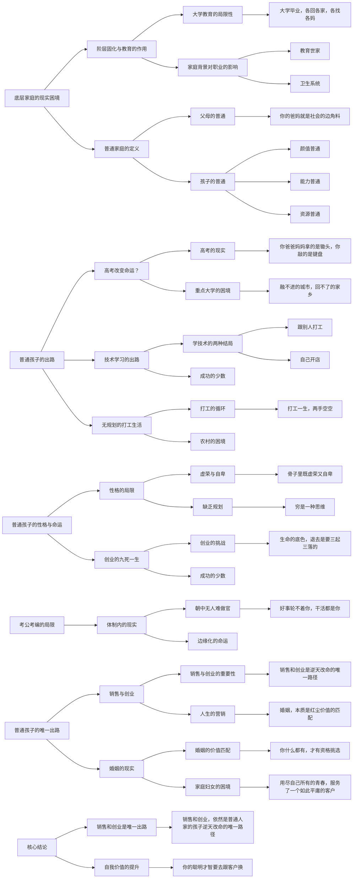

```mermaid
flowchart LR
    A[底层家庭的现实困境] --> B[阶层固化与教育的作用]
    B --> B1[大学教育的局限性]
    B1 --> B1a[大学毕业，各回各家，各找各妈]
    B --> B2[家庭背景对职业的影响]
    B2 --> B2a[教育世家]
    B2 --> B2b[卫生系统]
    A --> C[普通家庭的定义]
    C --> C1[父母的普通]
    C1 --> C1a[你的爸妈就是社会的边角料]
    C --> C2[孩子的普通]
    C2 --> C2a[颜值普通]
    C2 --> C2b[能力普通]
    C2 --> C2c[资源普通]

    D[普通孩子的出路] --> E[高考改变命运？]
    E --> E1[高考的现实]
    E1 --> E1a[你爸爸妈妈拿的是锄头，你敲的是键盘]
    E --> E2[重点大学的困境]
    E2 --> E2a[融不进的城市，回不了的家乡]
    D --> F[技术学习的出路]
    F --> F1[学技术的两种结局]
    F1 --> F1a[跟别人打工]
    F1 --> F1b[自己开店]
    F --> F2[成功的少数]
    D --> G[无规划的打工生活]
    G --> G1[打工的循环]
    G1 --> G1a[打工一生，两手空空]
    G --> G2[农村的困境]

    H[普通孩子的性格与命运] --> I[性格的局限]
    I --> I1[虚荣与自卑]
    I1 --> I1a[骨子里既虚荣又自卑]
    I --> I2[缺乏规划]
    I2 --> I2a[穷是一种思维]
    H --> J[创业的九死一生]
    J --> J1[创业的挑战]
    J1 --> J1a[生命的底色，退去是要三起三落的]
    J --> J2[成功的少数]

    K[考公考编的局限] --> L[体制内的现实]
    L --> L1[朝中无人难做官]
    L1 --> L1a[好事轮不着你，干活都是你]
    L --> L2[边缘化的命运]

    M[普通孩子的唯一出路] --> N[销售与创业]
    N --> N1[销售与创业的重要性]
    N1 --> N1a[销售和创业是逆天改命的唯一路径]
    N --> N2[人生的营销]
    N2 --> N2a[婚姻，本质是红尘价值的匹配]
    M --> O[婚姻的现实]
    O --> O1[婚姻的价值匹配]
    O1 --> O1a[你什么都有，才有资格挑选]
    O --> O2[家庭妇女的困境]
    O2 --> O2a[用尽自己所有的青春，服务了一个如此平庸的客户]

    P[核心结论] --> Q[销售和创业是唯一出路]
    Q --> Q1[销售和创业，依然是普通人家的孩子逆天改命的唯一路径]
    P --> R[自我价值的提升]
    R --> R1[你的聪明才智要去跟客户换]
```